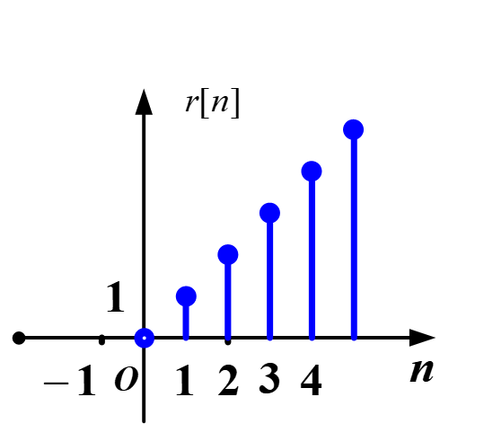
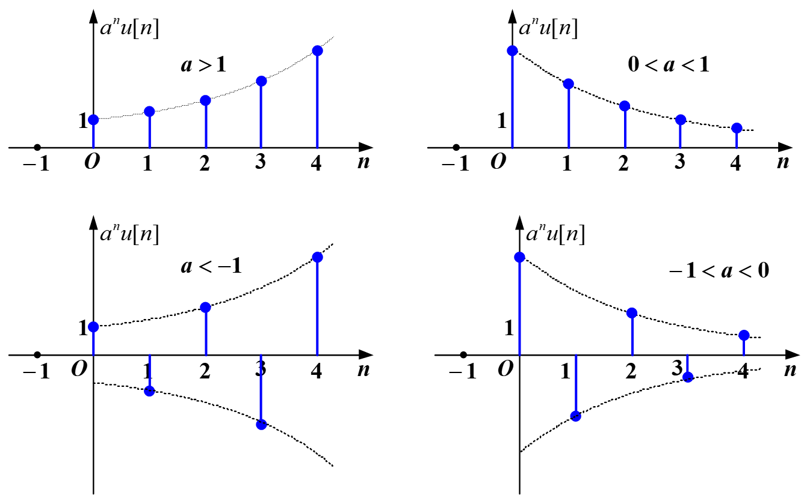

# CH_3

[TOC]

## Introduction

- Linear Constant-Coefficient Difference Equation Representations
- Block Diagram Representations
- Advantages of Discrete-Time System

## 3.1 Discrete-Time Signal/Sequence

### Representation

- Function Representation
- Graphical Representation

### Classifications

- **One-sided Sequence**: $n\geq 0$
- **Two-sided Sequence**: $-\infty\leq n\leq \infty$
- **Limited Sequence**: $n_1\leq n\leq n_2$

### Operations

- Addition: $$z[n]=x[n]+y[n]$$
- Multiplication: $$z[n]=x[n]\cdot y[n]$$
- Scalar Multiplication: $$z[n]=\alpha x[n]$$
- Time Shift: $$\begin{cases}
    z[n]=x[n-m]\qquad\text{Right Shift}\\[2ex]
    z[n]=x[n+m]\qquad\text{Left Shift}\\[2ex]
\end{cases}$$
- Time Reversal: $$z[n]=x[-n]$$
- Difference: $$\begin{cases}
    \Delta x[n]&= x[n+1]-x[n]\qquad\text{Forward}\\[2ex]
    \nabla x[n]&= x[n]-x[n-1]\qquad\text{Backward}\\[2ex]
\end{cases}$$
- Accumulation: $$z[n]=\sum_{k=\infty}^{\infty}{x[k]}$$
- Time Scaling (Decimation and Interpolation): $$x[n]\rightarrow x[an]\qquad x[n]\rightarrow x[\frac{n}{a}]$$
- Energy: $$E = \sum_{n=-\infty}^{\infty}{|x[n]|^2}$$

### Some Useful Modes

- Unit Impulse (Unit Sample)

$$
\delta[n]=
\begin{cases}
    0\qquad n\neq 0\\[2ex]
    1\qquad n=0
\end{cases}\\[4ex]
\delta[n-t]=
\begin{cases}
    0\qquad n\neq t\\[2ex]
    1\qquad n=t
\end{cases}\\[4ex]
x[n]=\sum_{m=-\infty}^{\infty}{x[m]\delta[n-m]}
$$

- Unit Step

$$
u[n]=
\begin{cases}
    1\qquad n\geq 0\\[2ex]
    0\qquad n<0
\end{cases}\\[4ex]
u[n]=\sum_{k=0}^{\infty}{\delta[n-k]}=\sum_{k=-\infty}^{n}{\delta[k]}\\[4ex]
\delta[n]=u[n]-u[n-1]
$$

- Rectangular Sequence

$$
R_N[n]=
\begin{cases}
    1\qquad 0\leq n\leq N-1\\[2ex]
    0\qquad \text{otherwise}
\end{cases}\\[4ex]
R_N[n]=u[n]-u[n-N]=\sum_{m=0}^{N-1}{\delta[n-m]}
$$

- Ramp Sequence

$$
r[n]=nu[n]
$$

- Real Exponential Sequence

$$
x[n]=a^n u[n]
$$

- Sinusoidal Sequence

$$
x[n]=\sin{n\omega_0}
$$

- Complex Exponential Sequence

$$
x[n]=e^{j\omega_0n}=\cos{\omega_0n}+j\sin{\omega_0n}
$$

## 3.2 Discrete-Time System Block Diagram Representations

## 3.3 Linear Constant-Coefficient Difference Equation

### General Nth-order Linear Constant-coefficient Difference Solution

$$
\sum_{k=0}^{N}{a_ky[n-k]}=\sum_{k=0}^{M}{b_kx[n-k]}
$$

### Solution of Difference Equations

- Recursive Method
- Homogeneous solution + Particular Solution
  - Natural Response:
    - Eigenvalue from equation
    - Homogeneous solution

$$
\begin{aligned}
    \sum_{k=0}^{N}{a_ky[n-k]}=0
\end{aligned}\\[4ex]
\begin{aligned}
    y[n]-&\alpha y[n-1]=0\\[2ex]
    \alpha &= \frac{y[n]}{y[n-1]}
\end{aligned}\\[6ex]
\Rightarrow\qquad y[n]=C\alpha^n\\[2ex]
$$

---

$$
\begin{aligned}
    a_0C\alpha^n+a_1C\alpha^{n-1}+\cdots +a_{N-1}C\alpha^{n-(N-1)}+a_NC\alpha^{n-N}=0\\[2ex]
    a_0\alpha^n+a_1\alpha^{n-1}+\cdots +a_{N-1}\alpha^{n-(N-1)}+a_N\alpha^{n-N}=0\qquad&\text{Eigen Equation}\\[2ex]
    \alpha_1,\alpha_2,\cdots,\alpha_N \qquad &\text{Eigenvalue}\\[2ex]
    C_1\alpha_1^n+C_2\alpha_2^n+\cdots+C_N\alpha_N^n \qquad &\text{Homogeneous Solution}\\[2ex]
\end{aligned}
$$

- Forced Response: Table look-up
  |Input: $x[n]$|Output: $y[n]$|
  |:--:|:--:|
  |$e^{an}$|$Ae^{an}$|
  |$e^{j\omega n}$|$Ae^{j\omega n}$|
  |$\cos{(\omega n)}$|$A\cos{(\omega n+\theta)}$|
  |$\sin{(\omega n)}$|$A\sin{(\omega n+\theta)}$|
  |$n^k$|$A_kn^k+A_{k-1}n^{k-1}+\cdots +A_1 n+ A_0$|
  |$A$|$C$|
  |$r^n$|$Cr^n$|
- Zero-input Solution + Zero-state Response
    - homogeneous solution
    - total solution
    - 
- Z-Transform Method

## 3.4

## 3.5 The Convolution Sum

### the Representation of Discrete-time Signals in Terms of Impulses

$$
\begin{aligned}
    x[n]&=\cdots+x[-1]\delta[n-1]+x[0]\delta[n]+x[1]\delta[n-1]+\\[2ex]
        &\cdots+x[m]\delta[n-m]+\cdots\\[2ex]
        &=\sum_{m=\infty}^{\infty}{x[m]\delta[n-m]}
\end{aligned}
$$

for convolution sum $\delta[n]\rightarrow h[n]$

**Time-Invariant** $\delta[n-m]\rightarrow h[n-m]$

**Homogeneity** $x[m]\delta[n-m]\rightarrow x[m]h[n-m]$

**Additivity** $y[n]=\sum_{m=\infty}^{\infty}{x[m]h[n-m]}=x[n]*h[n]$

### Properties of Convolution Sum

**Commutative Property**

$$x[n]*h[n]=h[n]*x[n]$$

**Distributive Property**

$$x[n]*[h_1[n]+h_2[n]]=x[n]*h_1[n]+x[n]*h_2[n]$$

**Associative Property**

$$x[n]*h_1[n]*h_2[n]=x[n]*(h_1[n]*h_2[n])$$

### Calculation of Convolution Sum

- Analytic Method
- Graphic Method
- Properties Method
- Upright Formula Method

## 3.6 Discrete-Time System Properties

- **Stability**
  $$\sum{|h[n]|}=P<\infty$$

- **Causality**
  $$
  h[n] = 0\quad\text{for}\quad n<0\\[2ex]
  h[n] = h[n]u[n]
  $$
