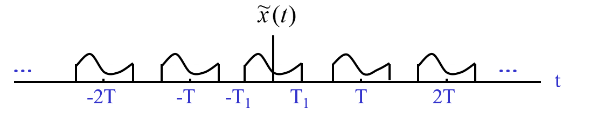
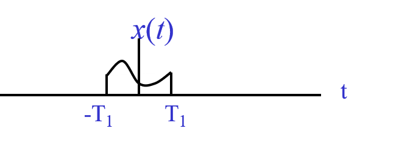

# CH_5

[TOC]

## Table and Equations

$$
X(j\omega)=\int_{-\infty}^{\infty}{x(t)e^{-j\omega t}\mathrm{d}t}\\[2ex]
x(t)=\frac{1}{2\pi}\int_{-\infty}^{\infty}{X(j\omega)e^{j\omega t}\mathrm{d}\omega}\\[2ex]
X(0)=\int_{-\infty}^{\infty}{x(t)\mathrm{d}t}\\[2ex]
x(0)=\frac{1}{2\pi}\int_{-\infty}^{\infty}{X(j\omega)\mathrm{d}\omega}\\[2ex]
\int_{-\infty}^{\infty}{|x(t)|^2\mathrm{d}t}=\frac{1}{2\pi}\int_{-\infty}^{\infty}\Big|X(j\omega)\Big|^2\mathrm{d}\omega\\[2ex]
y(t)=h(t)*x(t)\overset{\mathcal{F}}{\longleftrightarrow}Y(j\omega)=H(j\omega)X(j\omega)
$$

check real or imaginary, even or odd

- Real: $X(j\omega)=X^*(-j\omega)$
- Imaginary: $X(j\omega)=-X^*(-j\omega)$ (how to check $X^*$: $j = -j$)
- Even: $X(j\omega)=X(-j\omega)$
- Odd: $X(j\omega)=-X(-j\omega)$

|           Aperiodic Signal           |                    Fourier Signal                    |                              Signal                               |                               Fourier Transform                               | Fourier series coefficients |
| :----------------------------------: | :--------------------------------------------------: | :---------------------------------------------------------------: | :---------------------------------------------------------------------------: | :-------------------------: |
|            $ax(t)+by(t)$             |              $aX(j\omega)+bY(j\omega)$               |          $\sum_{k=-\infty}^{\infty}{a_ke^{j\omega_0 t}}$          |         $2\pi \sum_{k=-\infty}^{\infty}{a_k\delta(\omega-k\omega_0)}$         |            $a_k$            |
|              $x(t-t_0)$              |             $e^{-j\omega t_0}X(j\omega)$             |                         $e^{j\omega_0 t}$                         |                        $2\pi \delta (\omega-\omega_0)$                        |      $a_1=1\;a_k = 0$       |
|        $e^{j\omega_0 t}x(t)$         |               $X(j(\omega-\omega_0))$                |                          $\cos\omega_0t$                          |            $\pi[\delta(\omega-\omega_0)+\delta(\omega+\omega_0)]$             |  $a_1=a_{-1}=1/2\; a_k=0$   |
|               $x^*(t)$               |                   $X^*(-j\omega)$                    |                          $\sin\omega_0t$                          |       $\frac{\pi}{j}[\delta(\omega-\omega_0)-\delta(\omega+\omega_0)]$        | $a_1=-a_{-1}=1/2j\; a_k=0$  |
|               $x(-t)$                |                    $X(-j\omega)$                     |                             $x(t)=1$                              |                             $2\pi\delta(\omega)$                              |       $a_0=1\; a_k=0$       |
|               $x(at)$                |        $\frac{1}{\|a\|}X(\frac{j\omega}{a})$         | $x(t)=\begin{cases}1\quad \|t\|<T_1\\0\quad \|t\|>T_1\end{cases}$ |                       $\frac{2\sin\omega T_1}{\omega}$                        |
|             $x(t)*y(t)$              |                $X(j\omega)Y(j\omega)$                |                      $\frac{\sin Wt}{\pi t}$                      | $X(j\omega)=\begin{cases}1\quad \|\omega\|<W\\0\quad \|\omega\|>W\end{cases}$ |
|              $x(t)y(t)$              |        $\frac{1}{2\pi}X(j\omega)*Y(j\omega)$         |                           $\delta (t)$                            |                                       1                                       |
| $\frac{\mathrm{d}}{\mathrm{d}t}x(t)$ |                 $j\omega X(j\omega)$                 |                              $u(t)$                               |                     $\frac{1}{j\omega}+\pi\delta(\omega)$                     |
| $\int_{-\infty}^t{x(t)\mathrm{d}t}$  | $\frac{1}{j\omega}X(j\omega)+\pi X(0)\delta(\omega)$ |                          $\delta(t-t_0)$                          |                               $e^{j\omega t_0}$                               |
|               $tx(t)$                |   $j\frac{\mathrm{d}}{\mathrm{d}\omega}X(j\omega)$   |                           $e^{-at}u(t)$                           |                             $\frac{1}{a+j\omega}$                             |
|               $X(jt)$                |                  $2\pi x(-\omega)$                   |                          $te^{-at}u(t)$                           |                           $\frac{1}{(a+j\omega)^2}$                           |
|       $x(t)$ is real and even        |            $X(j)\omega$ is real and even             |
|        $x(t)$ is real and odd        |       $X(j\omega)$ is purely imaginary and odd       |

## 5.1 Representation of Aperiodic Signals: The Continuous-Time Fourier Time Transform

We think of _an aperiodic signal_ as the limit of _a periodic signal_ as the period **becomes arbitrarily large**, and we examine the limiting behavior of the Fourier series representation for the signal

$$
a_k = \frac{1}{T}\int_{-T/2}^{T/2}{\tilde{x}(t)e^{-jk\omega_0t}\mathrm{d}t}\\[2ex]
Ta_k = \int_{-T/2}^{T/2}{\tilde{x}(t)e^{-jk\omega_0t}\mathrm{d}t}\\[2ex]
$$

$$T\rightarrow \infty$$

### Fourier Transform of x(t)

$$
\begin{aligned}
    X(j\omega)&=\int_{-\infty}^{\infty}{x(t)e^{-j\omega t}\mathrm{d}t}\\[2ex]
    X(j\omega)&=\lim_{T\to\infty}{Ta_k}=\lim_{\omega_0}{2\pi \frac{a_k}{\omega_0}}
\end{aligned}\tag{5.1}
$$

$X(j\omega)$ is actually spectrum-density function and different from $a_k$, which is the spectrum of periodic signals

$$
\begin{aligned}
    \tilde{x}(t) &= \sum_{k = -\infty}^{\infty}{a_k e^{jk\omega_0t}}=\sum_{k = -\infty}^{\infty}{[\frac{1}{T}\int_{-T/2}^{T/2}{\tilde{x}(t)e^{-jk\omega_0t}\mathrm{d}t}]e^{jk\omega_0t}}\\[2ex]
                 &= \frac{\omega_0}{2\pi}\sum_{k = -\infty}^{\infty}{[\int_{-T/2}^{T/2}{\tilde{x}(t)e^{-jk\omega_0t}\mathrm{d}t}]e^{jk\omega_0t}}\\[2ex]
    x(t) &=\frac{1}{2\pi}\int_{-\infty}^{\infty}{X(j\omega)e^{j\omega t}\mathrm{d}\omega}
\end{aligned}\tag{5.2}
$$

the _equation 5.2_ is also called as the **inverse fourier transform**

and the pair of _equation 5.1_ and _equation 5.2_ is called as the **fourier transform pair**

> An useful relationship
> $a_k=\frac{1}{T}X(j\omega)|_{\omega = k \omega_0}$

### Fourier Transform Pair

$$
\begin{aligned}
    X(j\omega)&=\int_{-\infty}^{\infty}{x(t)e^{-j\omega t}\mathrm{d}t}= \mathcal{F}\{x(t)\}\\[2ex]
    x(t)&=\frac{1}{2\pi}\int_{-\infty}^{\infty}{X(j\omega)e^{j\omega t}\mathrm{d}\omega}= \mathcal{F}^{-1}\{X(j\omega)\}\\[2ex]
\end{aligned}
$$

**Fourier Transform**: $X(j\omega)=<x,e^{j\omega t}>$

### Dirichlet Conditions

- must be integrable
- bounded variation
- finite number of discontinuities

## 5.2 The Fourier Transform For Periodic Signals

$$
\begin{aligned}
    X(j\omega)&=\int_{-\infty}^{\infty}{e^{j\omega_0t}e^{-j\omega t}\mathrm{d}t}=\frac{1}{j(\omega_0-\omega)}e^{j(\omega_0-\omega)t}\Bigg|_{-\infty}^{\infty}\\[2ex]
    \delta(t) &= \frac{1}{2\pi}\int_{-\infty}^{\infty}{1\cdot e^{j\omega t}\mathrm{d}\omega}\\[2ex]
    2\pi \delta(t) &=\int_{-\infty}^{\infty}{e^{j\omega t}\mathrm{d}\omega}\qquad 2\pi \delta(-t) =\int_{-\infty}^{\infty}{e^{-j\omega t}\mathrm{d}\omega}\\[2ex]
    2\pi\delta(-\omega) &=\int_{-\infty}^{\infty}{e^{-j\omega t}\mathrm{d}t}\\[2ex]
    2\pi \delta(\omega_0-\omega)&=\int_{-\infty}^{\infty}{e^{-jt(\omega-\omega_0)}\mathrm{d}t}=\int_{-\infty}^{\infty}{e^{j\omega_0t}e^{-j\omega t}\mathrm{d}t}\\[2ex]
    x(t)&=\sum_{k = -\infty}^{\infty}{a_ke^{jk\omega_0t}}\\[2ex]
    X(j\omega)&=\sum_{k=-\infty}^{\infty}{a_k 2\pi \delta(\omega-k\omega_0)}=\sum_{k=-\infty}^{\infty}{2\pi a_k \delta(\omega - k\omega_0)}\\[2ex]
\end{aligned}
$$

## 5.3 Properties of The Continuous-Time Fourier Transform

### Linearity

$$
ax(t)+by(t)\overset{\mathcal{F}}{\longleftrightarrow}aX(j\omega)+bY(j\omega)
$$

### Time Shifting

$$
x(t-t_0)\overset{\mathcal{F}}{\longleftrightarrow}e^{-j\omega t_0}X(j\omega)
$$

### Conjugation and Conjugate Symmetry

$$
\begin{aligned}
    \text{if}\qquad x(t)&\overset{\mathcal{F}}{\longleftrightarrow}X(j\omega)\\[2ex]
    \text{then}\qquad x^*(t)&\overset{\mathcal{F}}{\longleftrightarrow}X^*(j\omega)\\[2ex]
    \text{if }x(t)\text{ is real, then}\qquad X(j\omega)&=X^*(j\omega)\\[2ex]
    X(j\omega)=|X(j\omega)|e^{j\phi(\omega)}&=Re(\omega)+jIm(\omega)\\[2ex]
    x(t)=x_e(t)+x_o(t)\\[2ex]
    x_e(t)\overset{\mathcal{F}}{\leftrightarrow}Re(\omega)&\qquad x_o(t)\overset{\mathcal{F}}{\leftrightarrow}jIm(\omega)
\end{aligned}
$$

### Differentiation and Integration

$$
\begin{aligned}
    \frac{\mathrm{d}x(t)}{\mathrm{d}t}&\overset{\mathcal{F}}{\leftrightarrow}j\omega X(j\omega)\\[2ex]
    \frac{\mathrm{d}^nx(t)}{\mathrm{d}t^n}&\overset{\mathcal{F}}{\leftrightarrow}(j\omega)^n X(j\omega)\\[2ex]
    \int_{-\infty}^t{x(\tau)\mathrm{d}\tau}&\overset{\mathcal{F}}{\leftrightarrow} \frac{1}{j\omega}X(j\omega)+\pi X(0)\delta(\omega)\\[2ex]
    &=X(j\omega)\cdot \Big[\frac{1}{j\omega}+\pi \delta(\omega)\Big]
\end{aligned}
$$

### Time and Frequency Scaling

$$
x(at)\overset{\mathcal{F}}{\longleftrightarrow}\frac{1}{|a|}X(\frac{j\omega}{a})
$$

### Duality

$$
X(jt)\overset{\mathcal{F}}{\longleftrightarrow}2\pi x(-\omega)
$$

#### Frequency Shifting

$$
e^{j\omega_0 t}x(t)\overset{\mathcal{F}}{\longleftrightarrow}X(j(\omega-\omega_0))
$$

#### Differentiation in Frequency-Domain

$$
-jtx(t)\overset{\mathcal{F}}{\longleftrightarrow}\frac{\mathrm{d}X(j\omega)}{\mathrm{d}\omega}
$$

### Parseval's Relation

$$
\int_{-\infty}^{\infty}{|x(t)|^2\mathrm{d}t}=\frac{1}{2\pi}\int_{-\infty}^{\infty}\Big|X(j\omega)\Big|^2\mathrm{d}\omega
$$

### Zero Point

$$
\begin{aligned}
    X(0)&=\int_{-\infty}^{\infty}{x(t)\mathrm{d}t}\\[2ex]
    x(0)&=\frac{1}{2\pi}\int_{-\infty}^{\infty}{X(j\omega)\mathrm{d}\omega}\\[2ex]
\end{aligned}
$$

### Real or Imaginary

- Real: $X(j\omega)=X^*(-j\omega)$
- Imaginary: $X(j\omega)=-X^*(-j\omega)$

### Even and Odd

- Even: $X(j\omega)=X(-j\omega)$
- Odd: $X(j\omega)=-X(-j\omega)$

## 5.4 The Convolution Property

$$
\begin{aligned}
    Y(j\omega)&=\int_{-\infty}^{\infty}{\Bigg[\int_{-\infty}^{\infty}{x(\tau)h(t-\tau)\mathrm{d}\tau}\Bigg]e^{-j\omega t}\mathrm{d}t}\\[2ex]
              &=\int_{-\infty}^{\infty}{x(\tau)\Bigg[\int_{-\infty}^{\infty}{e^{-j\omega t}h(t-\tau)\mathrm{d}t}\Bigg]\mathrm{d}\tau}\\[2ex]
              &= H(j\omega)\int_{-\infty}^{\infty}{e^{-j\omega \tau}x(\tau)\mathrm{d}\tau}\\[2ex]
              &= H(j\omega)X(j\omega)\\[2ex]
    y(t)=h(t)*x(t)&\overset{\mathcal{F}}{\leftrightarrow}Y(j\omega)=H(j\omega)X(j\omega)
\end{aligned}
$$

## 5.5 The Multiplication Property

$$
r(t)=s(t)p(t)\overset{\mathcal{F}}{\leftrightarrow}R(j\omega)=\frac{1}{2\pi}[S(j\omega)*P(j\omega)]
$$
