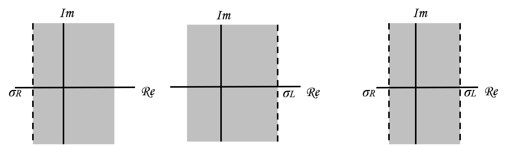
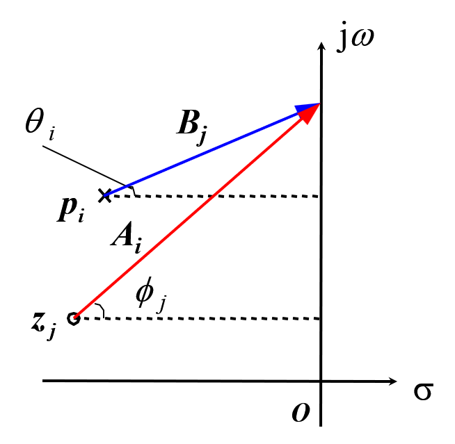
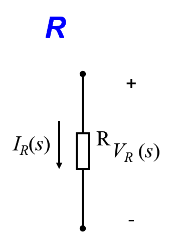
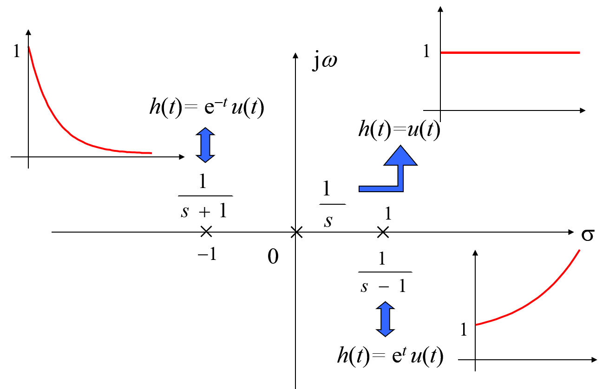
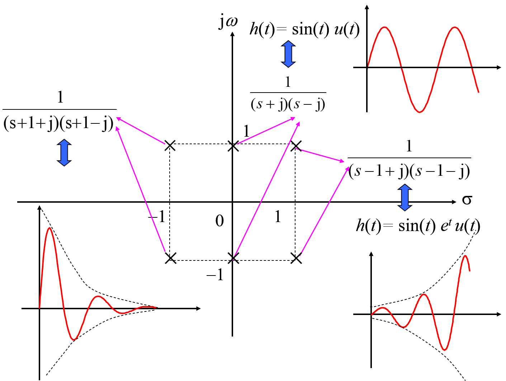

## CH_6

[TOC]

## Tables and Equations

$$
X(s) = \int_{-\infty}^{\infty}{x(t)e^{-st}\mathrm{d}t}\\[2ex]
X(s) = \int_{0^-}^{\infty}{x(t)e^{-st}\mathrm{d}t}\\[2ex]
x(0^+) =\lim_{s\to\infty}{sX(s)}\\[2ex]
\lim_{t\to\infty}{x(t)} = \lim_{s\to 0}{sX(s)}\\[2ex]
\frac{\mathrm{d}}{\mathrm{d}t}x(t)\longleftrightarrow sX(s)-x(0^{-})\\[2ex]
\frac{\mathrm{d}^2}{\mathrm{d}t^2}x(t)\longleftrightarrow s^2X(s)-sx(0^-)-x'(0^{-})\\[2ex]
\frac{\mathrm{d}^n}{\mathrm{d}t^n}x(t)\longleftrightarrow s^nX(s)-\sum_{k=0}^{n-1}{s^{n-k-1}x^{(k)}(0^-)}\\[2ex]
X(s) = M \frac{\prod_{i=1}^{R}(s-z_i)}{\prod_{j=1}^P(s-p_j)}\\[2ex]
V_L(s) = sLI_L(s) - Li_L(0^-)\\[2ex]
I_L(s) = \frac{1}{sL}V_L(s)+\frac{1}{s}i_L(0^-)\\[2ex]
V_C(s) = \frac{1}{sC}I_C(s)+\frac{1}{s}v_C(0^-)\\[2ex]
I_C(s) = sCV_C(s)-Cv_C(0^-)\\[2ex]
r(t) = e(t)*h(t)\longleftrightarrow R(s)= E(s)\cdot H(s)\\[2ex]
H(s) = \frac{R(s)}{E(s)}\\[2ex]
$$

|           Aperiodic Signal           |            Fourier Signal            |                   Signal                    |                 Transform                  |     ROC     |
| :----------------------------------: | :----------------------------------: | :-----------------------------------------: | :----------------------------------------: | :---------: |
|            $ax(t)+by(t)$             |            $aX(s)+bY(s)$             |                $\delta (t)$                 |                     1                      |   All $s$   |
|              $x(t-t_0)$              |           $e^{-s t_0}X(s)$           |                   $u(t)$                    |               $\frac{1}{s}$                |    $s>0$    |
|           $e^{s_0 t}x(t)$            |              $X(s-s_0)$              |                  $-u(-t)$                   |               $\frac{1}{s}$                |    $s<0$    |
|               $x^*(t)$               |              $X^*(s^*)$              |        $\frac{t^{n-1}}{(n-1)!}u(t)$         |              $\frac{1}{s^n}$               |    $s>0$    |
|               $x(at)$                |   $\frac{1}{\|a\|}X(\frac{s}{a})$    |       $-\frac{t^{n-1}}{(n-1)!}u(-t)$        |              $\frac{1}{s^n}$               |    $s<0$    |
|               $x(-t)$                |               $X(-s)$                |             $e^{-\alpha t}u(t)$             |            $\frac{1}{s+\alpha}$            | $s>-\alpha$ |
|             $x(t)*y(t)$              |              $X(s)Y(s)$              |            $-e^{-\alpha t}u(-t)$            |            $\frac{1}{s+\alpha}$            | $s<-\alpha$ |
| $\frac{\mathrm{d}}{\mathrm{d}t}x(t)$ |               $s X(s)$               |  $\frac{t^{n-1}}{(n-1)!}e^{-\alpha t}u(t)$  |          $\frac{1}{(s+\alpha)^n}$          | $s>-\alpha$ |
| $\int_{-\infty}^t{x(t)\mathrm{d}t}$  |          $\frac{1}{s}X(s)$           | $-\frac{t^{n-1}}{(n-1)!}e^{-\alpha t}u(-t)$ |          $\frac{1}{(s+\alpha)^n}$          | $s<-\alpha$ |
|               $-tx(t)$               | $\frac{\mathrm{d}}{\mathrm{d}s}X(s)$ |                $\delta(t-T)$                |                 $e^{-sT}$                  |   All $s$   |
|                                      |                                      |           $[\cos\omega_0 t]u(t)$            |         $\frac{s}{s^2+\omega_0^2}$         |    $s>0$    |
|                                      |                                      |           $[\sin\omega_0 t]u(t)$            |     $\frac{\omega_0}{s^2+\omega_0^2}$      |    $s>0$    |
|                                      |                                      |     $[e^{-\alpha t}\cos\omega_0 t]u(t)$     | $\frac{s+\alpha}{(s+\alpha)^2+\omega_0^2}$ | $s>\alpha$  |
|                                      |                                      |     $[e^{-\alpha t}\sin\omega_0 t]u(t)$     | $\frac{\omega_0}{(s+\alpha)^2+\omega_0^2}$ | $s>\alpha$  |

## 6.1 The Laplace Transform

For some signals which have no Fourier transforms, we can preprocess them like

$$
X(j\omega) = \int_{-\infty}^{\infty}{\Big[x(t)e^{-\sigma t}\Big]e^{-j\omega t}\mathrm{d}t}
$$

define $s = \sigma+j\omega$, and using $X(s)$ to denote this integral

$$
X(s) = \int_{-\infty}^{\infty}{x(t)e^{-st}\mathrm{d}t}
$$

which is a two-sided (bilateral) Laplace Transform

And we can say that the Laplace Transform is an extension of the Fourier

> **The Fourier transform is a special case of the Laplace transform when $\sigma = 0$**

$$
X(s) = \int_{0^-}^{\infty}{x(t)e^{-st}\mathrm{d}t}
$$

which is a one-sided (unilateral) Laplace Transform

some useful LT pairs

> $\cos(\omega t)u(t)\overset{LT}{\longleftrightarrow}\frac{s}{s^2+\omega^2}$, $\Re\{s\}>0$ > $\sin(\omega t)u(t)\overset{LT}{\longleftrightarrow}\frac{\omega}{s^2+\omega^2}$, $\Re\{s\}>0$

Generally, the Laplace transform is rational

$$
X(s) = \frac{N(s)}{D(s)}
$$

- the roots of $N(s)$ are defined as the zeros
- the roots of $S(s)$ are defined as the poles

the representation of $X(s)$ through its poles an zeros in the s-plane is referred to a as the pole-zero plot of $X(s)$

## 6.2 Region of Convergence for Laplace Transform

- The ROC of $X(s)$ consists of stripes parallel to the $j\omega$-axis in the s-plane
- For rational Laplace transforms, the ROC does not contain any poles
- If $x(t)$ is of finite duration and is absolutely integrable, the the ROC id the entire s-plane

the line $\Re\{s\}=\sigma_0$ is in the ROC

- If $x(t)$ is **right sided**, then all values of s for which $\Re\{s\}>\sigma_0$ will also be in the ROC; and the ROC of a right-sided signal is a right-half plane
- If $x(t)$ is **left sided**, then all values of s for which $\Re\{s\}<\sigma_0$ will also be in the ROC; and the ROC of a left-sided signal is a left-half plane
- If $x(t)$ is **two sided**, then the ROC will consist of a strip in the s-plane that includes the line $\Re\{s\}=\sigma_0$

- If the Laplace transform $X(s)$ of $x(t)$ is rational, then its ROC is bounded by poles or extends to infinity. In addition, no poles of $X(s)$ are contained in the ROC
- If the Laplace transform $X(s)$ of $x(t)$ is rational, then if $x(t)$ is right sided, the ROC is the region in the s-plane to the right of the rightmost pole. If $x(t)$ is left sided, the ROC is the region in the s-plane to the left of the leftmost pole

## 6.3 The Inverse Laplace Transform

from the inverse Fourier transform, we could conclude that

$$
x(t)e^{-\sigma t}=\mathcal{F}^{-1}\{X(s)\}=\frac{1}{2\pi}\int_{-\infty}^{\infty}{X(s)e^{j\omega t}\mathrm{d}\omega}
$$

multiplying both sides both by $e^{\sigma t}$, we can obtain

$$
x(t)=\frac{1}{2\pi}\int_{-\infty}^{\infty}{X(s)e^{st}\mathrm{d}\omega}
$$

and obtain that $\mathrm{d}s=j\mathrm{d}\omega$

$$
x(t)=\frac{1}{2\pi j}\int^{\sigma+j\omega}_{\sigma-j\omega}{X(s)e^{st}\mathrm{d}s}
$$

we only discuss the class of **rational transforms**, the inverse Laplace transform can be determine by using the technique of **partial-fraction expansion**

$$
\begin{aligned}
X(s)=\frac{N(s)}{D(s)}&=\frac{a_ms^m+a_{m-1}s^{m-a}+\cdots+a_1s+a_0}{b_ns^n+b_{n-1}s^{n-1}+\cdots+b_1s+b_0}\\[2ex]
    &= \frac{a_m(s-z_1)(s-z_2)\cdots(s-z_m)}{b_n(s-p_1)(s-p_2)\cdots(s-p_n)}
\end{aligned}
$$

- $m<n$ and no repeated roots in poles: $X(s)=\sum_{i=1}^{n}{\frac{A_i}{s+a_i}}$

## 6.4 Geometric Evaluation of the Fourier Transform from the Pole-Zero Plot

a general rational Laplace transform has the form

$$
X(s) = \frac{N(s)}{D(s)}
$$

which can be factored into the form

$$
X(s) = M \frac{\prod_{i=1}^{R}(s-z_i)}{\prod_{j=1}^P(s-p_j)}
$$

where $z_i$, $p_j$ are zeros and poles of $X(s)$

then denote **zero vectors** and **pole vectors**:

$$
j\omega -z_i = A_i e^{j\phi_i}\\[2ex]
j\omega -p_j = B_j e^{j\phi_i}\\[2ex]
$$

- Magnitude:
  $$
  |X(j\omega)| = M \frac{\prod_{i=1}^R(j\omega-z_i)}{\prod_{j=1}^R(j\omega-p_j)}
  $$
- Phase:
  $$
  \angle X(j\omega) = \sum_{i=1}^R{\phi_i}-\sum_{j=1}^P{\theta_j}
  $$

## 6.5 Properties of the Laplace Transform

### Linearity

$$
ax_1(t)+bx_2(t)\longleftrightarrow aX_1(s)+bX_2(s)\qquad \text{ROC} = R_1\cap R_2
$$

### Time shifting

$$
x(t-t_0)\longleftrightarrow e^{-st_0}X(s)\qquad \text{ROC}=R\\[2ex]
$$

### Shifting in the s-domain

$$
e^{s_0t}x(t)\longleftrightarrow X(s-s_0)\qquad \text{ROC}=R+\Re\{s_0\}\\[2ex]
$$

### Time scaling

$$
x(\alpha t)\longleftrightarrow \frac{1}{|\alpha|}X\Big(\frac{s}{\alpha}\Big)\qquad \text{ROC}=\alpha R\\[2ex]
x(-t)\longleftrightarrow X(-s)\qquad \text{ROC}=-R\\[2ex]
$$

### Conjugation

$$
x^*(t)\longleftrightarrow X^*(s^*)\qquad \text{ROC}=R\\[2ex]
$$

when $x(t)$ is real: $X(s) = X^*(s^*)$

> if $x(t)$ is real and if $X(s)$ has a pole or zero at $s = s_0$ , then $X(s)$ also has a pole or zero at the complex conjugate point $s = s_0^*$.

### Convolution property

$$
x_1(t)*bx_2(t)\longleftrightarrow X_1(s)X_2(s)\qquad \text{ROC} = R_1\cap R_2
$$

### Differentiation in the time domain

$$
\frac{\mathrm{d}x(t)}{\mathrm{d}t}\longleftrightarrow sX(s)\qquad \text{ROC} = R\\[2ex]
$$

### Differentiation in the s-domain

$$
-tx(t)\longleftrightarrow \frac{\mathrm{d}X(s)}{\mathrm{d}s}\qquad \text{ROC}=R\\[2ex]
$$

### Integration in the time domain

$$
\int_{-\infty}^{t}{x(\tau)\mathrm{d}\tau}\longleftrightarrow\frac{X(s)}{s} \qquad \text{ROC} = R\cap\{\Re\{s\}>0\}
$$

### The initial-value and final-value theorems

#### Initial-value Theorem

If $x(t) = 0$ for $t < 0$ and $x(t)$ contains no impulses or higher-order singularities at $t = 0$

$$
x(0^+) =\lim_{s\to\infty}{sX(s)}
$$

#### Final-value Theorem

If $x(t) = 0$ for $t < 0$ and $x(t)$ has a finite limit as $t\to\infty$

$$
\lim_{t\to\infty}{x(t)} = \lim_{s\to 0}{sX(s)}
$$

## 6.6 The Unilateral Laplace Transform

> the bilateral transform and the unilateral transform of a casual signal are identical
> the ROC for the unilateral transform is always a right-half plane
> unilateral transform can be recognized as the bilateral transform of $x(t)u(t)$

### Differentiation in the Time Domain

$$
\frac{\mathrm{d}}{\mathrm{d}t}x(t)\longleftrightarrow sX(s)-x(0^{-})\\[2ex]
\frac{\mathrm{d}^n}{\mathrm{d}t^n}x(t)\longleftrightarrow s^nX(s)-\sum_{k=0}^{n-1}{s^{n-k-1}x^{(k)}(0^-)}
$$

### Solving Differential Equations Using the Unilateral Laplace Transform

$$
\sum_{k=0}^{N}{a_k \frac{\mathrm{d}^k y(t)}{\mathrm{d}t^k}}=\sum_{k=0}^{M}{b_k \frac{\mathrm{d}^k x(t)}{\mathrm{d}t^k}}\\[2ex]
H(s) = \frac{\sum_{k=0}^{M}{b_k s^k}}{\sum_{k=0}^{N}{a_k s^k}}
$$

### Representation of Circuits in s-domain

#### Resistor

$$
v_R(t) = Ri_R(t)\\[2ex]
V_R(s) = RI_R(s)\\[2ex]
$$

#### Inductor

$$
v_L(t) = L\frac{\mathrm{d}i_L(t)}{\mathrm{d}t}\\[2ex]
V_L(s) = sLI_L(s) - Li_L(0^-)\\[2ex]
I_L(s) = \frac{1}{sL}V_L(s)+\frac{1}{s}i_L(0^-)\\[2ex]
$$

#### Conductor

$$
i_c(t) = C\frac{\mathrm{d}v_c(t)}{\mathrm{d}t}\\[2ex]
V_C(s) = \frac{1}{sC}I_C(s)+\frac{1}{s}v_C(0^-)\\[2ex]
I_C(s) = sCV_C(s)-Cv_C(0^-)\\[2ex]
$$

## 6.7 System Function

$$
r(t) = e(t)*h(t)\longleftrightarrow R(s)= E(s)\cdot H(s)\\[2ex]
H(s) = \frac{R(s)}{E(s)}\\[2ex]
$$

### $H(s)$ Poles

- Single Pole

- **Positive Real Number**: increase exponentially
- **Negative Real Number**: decrease exponentially

---

- Conjugation Poles

- **Poles on Imaginary Axis**: Constant amplitude shock
- **Poles on Right Part of ROC**: Shock increase
- **Poles on Left Part of ROC**: Shock decrease

## 6.8 Analysis and Characterization of LTI system Using the Laplace Transform

### Causality

> **The ROC associated with the system function for a causal system is a right-half plane**

### Stability

> **An LTI system is stable if and only if the ROC of its system function $H(s)$ includes the $j\omega$-axis**

> A causal system with rational system function $H(s)$ is stable if and only if all of the poles of $H(s)$ lie in the left-half of the s-plane ―i.e. all of the poles have negative real parts.
