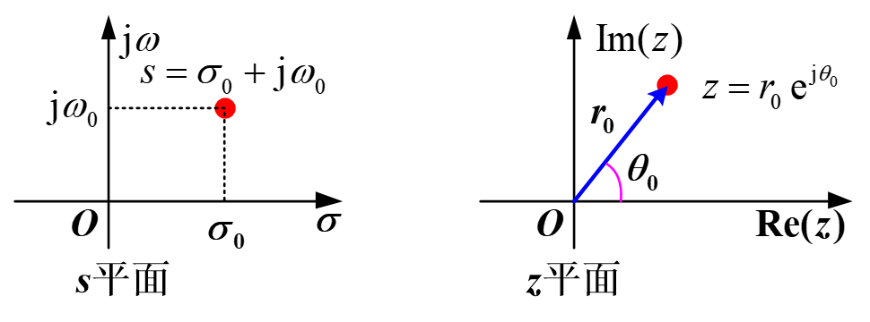
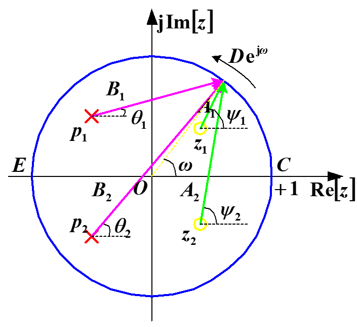

# CH_7

[TOC]

## Introduction

the z-transform is the discrete-time counterpart of the Laplace transform

the z-transform expand the application in which Fourier analysis can be used

## 7.1 The z-Transform

### Definition

the z-transform of a general discrete-time signal $x[n]$ is defined as

$$
X(z) = \sum_{n=-\infty}^{\infty}{x[n]z^{-n}}
$$

Expressing the complex variable $z$ in polar form as $z = re^{j\omega}$

$$
X(re^{j\omega})= \sum_{n = -\infty}^{+\infty}{x[n](re^{j\omega})^{-n}}=\sum_{n=-\infty}^{+\infty}(x[n]r^{-n})e^{-j\omega n}
$$

$X(re^{j\omega})$ is the Fourier transform of $x[n]$ multiplied by a real exponential $r^{-n}$

for $r = 1$, or equivalently, $|z| = 1$, z-transform equation reduces to the Fourier transform

$$
X(z)|_{z=e^{j\omega}} = X(e^{j\omega})=\mathcal{F}\{x[n]\}
$$

the z-transform reduces to the Fourier transform for values of z on the unit circle

### The Relationship of Laplace Transform and z-Transform

$$
x_s(t) = x(t)\cdot\delta_T(t) = x(t)\sum_{n= - \infty}^{\infty}{\delta(t-nT)}= \sum_{n= -\infty}^{\infty}{x(nT)\delta(t-nT)}\\[2ex]
\begin{aligned}
    X(s) &= \int_{-\infty}^{\infty}{\sum_{n=-\infty}^{\infty}{x(nT)\delta(t-nT)e^{-st}\mathrm{d}t}}\\[2ex]
    &= \sum_{n=-\infty}^{\infty}{x(nT)\int_{-\infty}^{\infty}{\delta(t-nT)e^{st}\mathrm{d}t}} = \sum_{n=-\infty}^{\infty}{x(nT)e^{-snT}}
\end{aligned}
$$

Let $z = e^{sT}$ and $x(nT)\to x[n]$

$$
X(s)|_{z=e^{sT}}=\sum_{n=-\infty}^{\infty}{x[n]z^{-n}} = X(z)
$$

### Polar Coordinates

since $s = \sigma+j\omega$ and $z = e^{sT}$

$$
z = e^{(\sigma+j\omega)T}=e^{\sigma T}\cdot e^{j\omega T}\\[2ex]
z = r e^{j\theta}\Rightarrow
\begin{cases}
    \text{radius:}\;r = e^{\sigma T}\\[2ex]
    \text{angle:}\;\theta = \omega T = 2\pi \frac{\omega}{\omega_s}
\end{cases}
$$

where $\omega_s$ is the sampling frequency

$$
\sigma = 0 \longleftrightarrow r = 1\\[2ex]
\sigma < 0 \longleftrightarrow r < 1\\[2ex]
\sigma > 0 \longleftrightarrow r > 1\\[2ex]
\sigma:-\infty\to\infty \longleftrightarrow r: 0 \to \infty\\[2ex]
\sigma = 0 ,\; \omega = 0 \longleftrightarrow r= 1 ,\; \theta=0\\[2ex]
\omega = 0\longleftrightarrow \theta= 0\\[2ex]
\omega = \pm\frac{\omega_s}{2}\longleftrightarrow \theta= \pi\\[2ex]
$$

> if the ROC includes the unit circle, then the Fourier transform also converges

## 7.2 The Region of Convergence for the z-Transform

### Properties

1. The ROC of $X(z)$ consists of a ring in the z-plane centered about the origin
2. The ROC does not contain any poles

---

3. if $x[n]$ is of finite duration, then the ROC is the entire z-plane, except possibly $z=0$ and/or $z = \infty$
4. if $x[n]$ is a right-sided sequence, and if the circle $|z| = r_0$ is in the ROC, then all finite values of z for which $|z|>r_0$ will also be in the ROC
5. if $x[n]$ is a left-sided sequence, and if the circle $|z| = r_0$ is in the ROC, then all values of z for which $0<|z|<r_0$ will also be in the ROC

---

6. if $x[n]$ is two sided, and if the circle $|z| = r_0$ is in the ROC, then the ROC will consist of a ring in the z-plane that includes the circle $|z|=r_0$

---

7. if the z-transform $X(z)$ of $x[n]$ is rational, then its ROC is bounded by poles or extends to infinity
8. if the z-transform $X(z)$ of $x[n]$ is rational, and if $x[n]$ is right sided, then the ROC is the region in the z-plane outside the outermost pole
9. if the z-transform $X(z)$ of $x[n]$ is rational, and if $x[n]$ is left sided, then the ROC is the region in the z-plane inside the innermost nonzero pole

## 7.3 The Inverse z-Transform

### Partial-Fraction Expansion

$$
X(z) = \sum_{i=1}^{m} \frac{A_i}{1-a_iz^{-1}}
$$

- ROC outside the pole: $\frac{A_i}{1-a_iz^{-1}}\leftrightarrow A_i a_i^nu[n]$
- ROC outside the pole: $\frac{A_i}{1-a_iz^{-1}}\leftrightarrow -A_i a_i^nu[-n-1]$

### Power-series Expansion

$$
X(z) = \sum_{n=-\infty}^{\infty}{x[n]z^{-n}}
$$

The coefficients in this power series are the sequence values $x[n]$ since $\delta[n+n_0]\leftrightarrow z^{n_0}$

## 7.4 Geometric Evaluation of Fourier Transform from the Pole-Zero Plot

$$
H(z)=\frac{\prod_{r=1}^{M}{\pod{z-z_r}}}{\prod_{k=1}^{N}{\pod{z-p_k}}}\\[2ex]
H(e^{j\omega})=\frac{\prod_{r=1}^{M}{\pod{e^{j\omega}-z_r}}}{\prod_{k=1}^{N}{\pod{e^{j\omega}-p_k}}}\\[2ex]
$$

Let $e^{j\omega}-z_r = A-r e^{j\psi_r}$, $e^{j\omega}-p_k=B_ke^{j\theta_k}$

- Magnitude Response: $|H(e^{j\omega})|=\frac{\prod_{r=1}^M{A_r}}{\prod_{k=1}^N{B_k}}$
- Phase Response: $\phi(\omega） = \sum_{r=1}^{M}{}\psi_r-\sum_{k=1}^N{\theta_k}$

## 7.5 Properties of the z-Transform

### Linearity

$$
ax_1[n]+bx_2[n] \longleftrightarrow aX_1(z)+bX_2(z)
$$

with the ROC containing $R_1\cap R_2$

### Time Shifting

$$
z[n-n_0]\longleftrightarrow z^{-n_0}Z(z)
$$

with ROC = R, except for the possible addition or deletion of the origin or infinity

> For $n_0>0$, poles will be introduced at $z=0$
> For $n_0<0$, zeros will be introduced at $z=0$

### Scaling in the z-Domain

$$
z_0^nx[n]\longleftrightarrow X\Big(\frac{z}{z_0}\Big)
$$

with ROC = $|z_0|R$

> Special Case: when z = $e^{j\omega_0}$, $e^{j\omega_0 n}x[n]\longleftrightarrow X(e^{-j\omega_0}z)$ with ROC = R

### Time Expansion

$$
x_{(k)}[n]=
\begin{cases}
    x[n/k]\qquad \text{if n is a multiple of k}\\[2ex]
    0\qquad \text{if n is not multiple of k}
\end{cases}
$$

$$
x_{(k)}[n]\longleftrightarrow X(z^k)
$$

with ROC = $R^{1/k}$

### Conjugation

$$
x^*[n]\longleftrightarrow X^*(z^*)
$$

with ROC = R

> if $x[n]$ is real. $X(z)=X^*(z^*)$
> if X(z) has a pole (or zero) at $z = z_0$, it must also have a pole (or zero) at the complex conjugate point $z=z_0^*$

### Convolution Property

$$
x_1[n]*x_2[n]\longleftrightarrow X_1(z)X_2(z)
$$

with ROC containing $R_1\cap R_2$

> the ROC may be larger than $R_1\cap R_2$ if pole-zero cancellation occurs in the product

### Difference and Sum Property in Time Domain

$$
x[n]-x[n-1]\longleftrightarrow (1-z^{-1})X(z)\\[2ex]
\sum_{k=-\infty}^{n}{x[k]}\longleftrightarrow \frac{1}{1-z^{-1}}X(z)
$$

### Differentiation in the z-Domain

$$
nx[n]\longleftrightarrow -z\frac{\mathrm{d}X(z)}{\mathrm{d}z}
$$

with ROC = R

### Initial-Value and Final-Value Theorems

if $x[n]$ is a casual sequence, then

$$
x[0] = \lim_{z\to\infty}{X(z)}\\[2ex]
x[n+1] \longleftrightarrow z[X(z)-x(0)]
$$

## 7.6 Analysis and Characterization of LTI System Using z-Transform

$$
Y(z) = X(z)H(z)
$$

where $H(z)$ is the system function/transfer function

### Causality

**Definition**: if the ROC of its system function is the exterior of a circle, including infinity

A system with rational system with rational system function $H(z)$ is casual if and only if:

- the ROC is the exterior of a circle outside the outermost pole
- for $H(z)$, the order of numerator cannot be greater than the order of the denominator

### Stability

**Definition**: the ROC of its system function $H(z)$ includes the unit circle, $|z|=1$

A system with rational system function $H(z)$ is stable if and only if all of the poles of $H(z)$ lie inside the i=unit circle

### Linear Constant-Coefficient Difference Equations

$$
H(z) = \frac{Y(z)}{X(z)} = \frac{\sum_{k=0}^M{b_kz^{-k}}}{\sum_{k=0}^{N}{a_kz^{-k}}}
$$

### The Relationship between H(z)'s Poles and h[n] Waveform

| s-plane  |              s-plane              |       z-plane        |                 z-plane                  |
| :------: | :-------------------------------: | :------------------: | :--------------------------------------: |
| 极点位置 |            $h(t)$特点             |       极点位置       |                $h[n]$特点                |
|  虚轴上  |               等辐                |       单位圆上       |                   等辐                   |
|  原点处  | $u(t)\leftrightarrow \frac{1}{s}$ | $\theta = 0\; z = 1$ | $u[n]\leftrightarrow \frac{1}{1-z^{-1}}$ |
| 左半平面 |               减幅                |       单位圆内       |                   减幅                   |
| 右半平面 |               增幅                |       单位圆外       |                   增幅                   |

## 7.7 System Function Algebra and Block Diagram Representations

$$
H(z) =H_1(z)+H_2(z)
$$

$$
H(z) = H_1(z)\cdot H_2(z)
$$

$$
H(z) = \frac{H_1(z)}{1+H_1(z)\cdot H_2(z)}
$$

## 7.8 The Unilateral z-Transform

### Definition

$$
X(z) = \sum_{n=0}^{\infty}{x[n]z^{-n}}
$$

which could be also thought as the bilateral z-transform of $x[n]u[n]$

> the ROC must always be the exterior of a circle

### Properties of the Unilateral z-Transform

- time delay

$$
x[n-m]\longleftrightarrow z^{-m}\Big(X(z)+\sum_{n=-m}^{-1}{x[n]z^{-n}}\Big)
$$

- time advance

$$
x[n+m]\longleftrightarrow z^{m}\Big(X(z)-\sum_{n=0}^{m-1}{x[n]z^{-n}}\Big)
$$

### Solving Difference Equations Using the Unilateral z-Transform

need more examples

## 7.9 The Discrete-Time Fourier Transform

### Definition

$$
X(e^{j\omega}) = \sum_{n=-\infty}^{\infty}{x[n]e^{-j\omega n}}\\[2ex]
x[n] = \frac{1}{2\pi} \int_{-\pi}^{\pi}{X(e^{j\omega})e^{j\omega n}\mathrm{d}\omega}
$$

### Relationship between DTFT and z-Transform

$$
X(e^{j\omega}) = X(z)|_{z=e^{j\omega}}
$$

periodic with period $2\pi$

## 7.10 Frequency Response of a Discrete-time System

### Definition

$$
H(e^{j\omega}) = \sum_{n=-\infty}^{\infty}{h[n]e^{-jn\omega}}\\[2ex]
h[n] = \frac{1}{2\pi}\int_{-\pi}^{\pi}{H(e^{j\omega})e^{jn\omega}\mathrm{d}\omega}
$$

For a casual and stable system, let $x[n]=e^{j\omega n}$

$$
y[n] = x[n]*h[n] = \sum_{k=-\infty}^{\infty}{h[k]x[n-k]} = \sum_{k=-\infty}^{\infty}{h[k]e^{j\omega(n-k)}}\\[2ex]
= e^{j\omega n}\sum_{k=-\infty}^{\infty}{h[k]e^{-j\omega k}}
$$

Let $H(e^{j\omega})=\sum_{n=-\infty}^{\infty}{h[n]e^{-j\omega n}}$

then it comes to

$$
y[n] = e^{j\omega n}H(e^{j\omega})\\[2ex]
H(e^{j\omega}) = H(z)|_{z=e^{j\omega}}=|H(e^{j\omega})|\cdot e^{j\phi(\omega)}
$$

- Magnitude Response: $|H(e^{j\omega})|\sim\omega$
- Phase Response: $\phi(\omega)\sim\omega$
