# CH_1

## 1.1 Signals

### communication system

a function conveys information about the behavior or attributes of some phenomenon

### physical world

quantity exhibiting variation in time or variation in space

**signals are mathematical functions**

- Independent variable = time

- Dependent variable = voltage, flow rate, sound pressure, ...

**signals can be represented by graph**

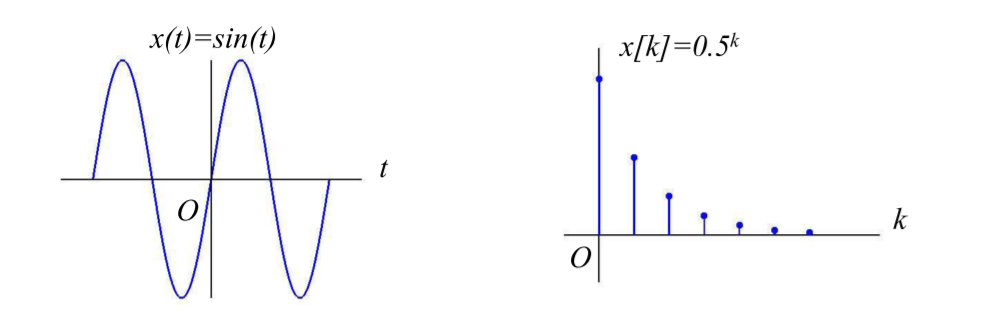

## 1.2 Classifications of Signals

### continuous-time and discrete-time signals

- continuous-time signals' independent variable is continuous

$$
x(t)=e^t
$$

- discrete-time signals are defined only at discrete times:

$$
x[n]=2^n
$$

- the independent variable is inherently discrete

- sampling of continuous-time signals

### analog and digital signals

- analog signals: continuous in both time and amplitude
- digital signals: discrete in both time and amplitude

### periodic and aperiodic signals

- for continuous-time

$$
x(t)=x(t+T)
$$

- for discrete-time

$$
x[n]=x[n+N]
$$

### determinate and random signals

- **a determinate signal**: _x(t)_

- a random signal: cannot find a function to represent it

        E.g.: noise, speech

### energy and power signals

- energy signals $0<E<\infty$, $P\to 0$

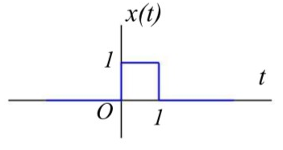

- power signals $0<P<\infty$, $E\to\infty$

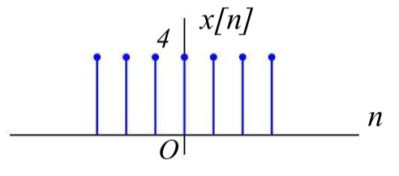

- signals with neither finite E nor finite P $E\to\infty$, $P\to \infty$

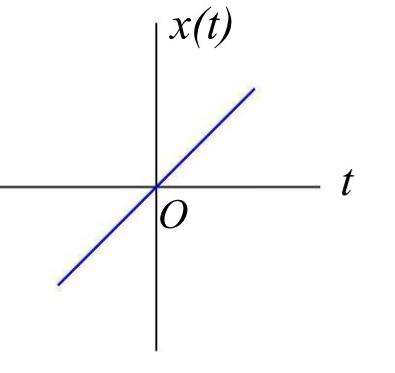

## 1.3 Transformations of the Independent Variable of Signals

### time shift

$$
x(t)\to x(t-t_0)
$$

### time reversal _(left +, right -)_

$$
x(t)\to x(-t)
$$

### time scaling

$$
x(t)\to x(k_0t)
$$

**First Scaling, Second Shift**

**先尺缩，再平移**

## 1.4 Some Useful Signal Modes

### Real Exponential Signals

$$
x(t)=Ce^{at}
$$

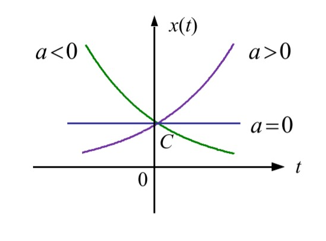

### Periodic Complex Exponential and Sinusoidal Signals

$$
x(t)=Ce^{j\omega_0t}
$$

### General Complex Exponential Signals

$$
\begin{aligned}
  C&=|C|e^{j\theta},\;a=r+j\omega_0\\[2ex]
  Ce^{at}&=|C|e^{j\theta}e^{(r+j\omega_0)t}=|C|e^{rt}e^{j(\omega_0t+\theta)}\\[2ex]
  Ce^{at}&=|C|e^{rt}(\cos(\omega_0t+\theta)+j\sin(\omega_0t+\theta))
\end{aligned}
$$

- When r = 0, both parts are sinusoidal;
- When r > 0, both parts are growing sinusoidal;
- When r < 0, both parts are decaying sinusoidal (damped sinusoids).

### Sampling Signals

$$
Sa(t)=\frac{\sin{t}}{t}
$$

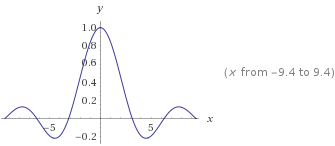

## 1.5 The Unit Impulse and Unit Step Functions

### Unit Step Function

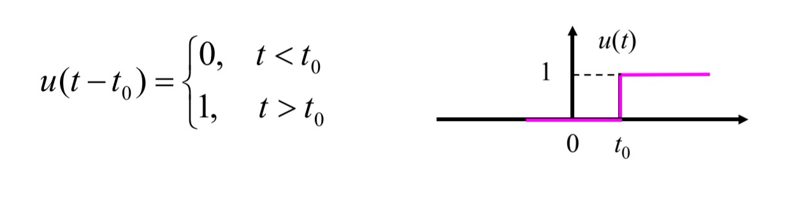

### Unit Impulse Function

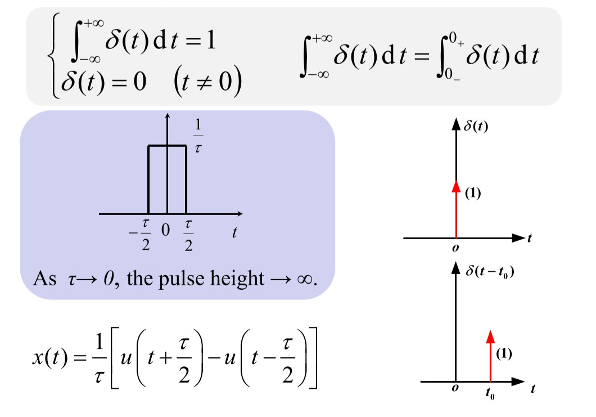

1. **Sampling Property**

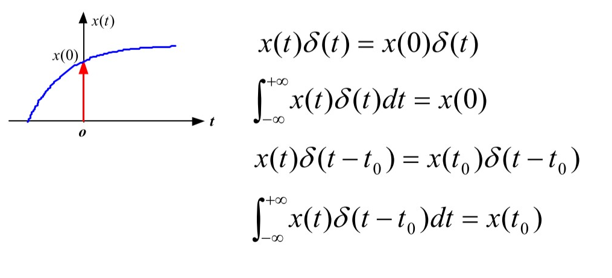

2. Even Function

$$
\delta(t)=\delta(-t)
$$

3. Time Scaling

$$
\delta(kt)=\frac{1}{|k|}\delta(t)
$$

4. **Relationship to Unit Step Function**

$$
\begin{aligned}
  u(t)&=\int_{-\infty}^{t}{\delta(\tau)\mathrm{d}\tau}\\[2ex]
  \delta(t)&=\frac{\mathrm{d}u(t)}{\mathrm{d}t}
\end{aligned}
$$

### Impulse Doublet Signal

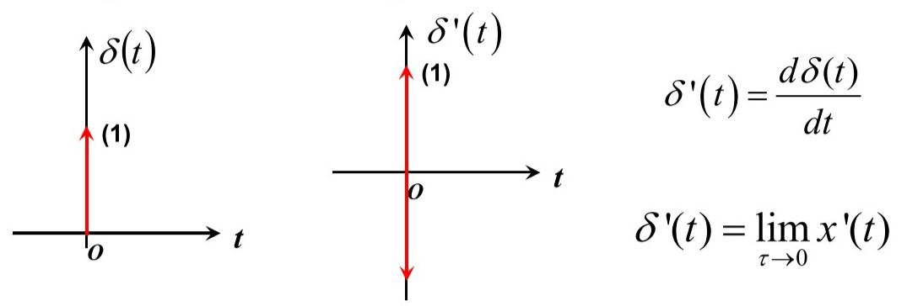

1. **Sampling Property**
$$
\begin{aligned}
x(t)=\delta'(t-t_0)&=x(t_0)\delta'(t-t_0)-x'(t_0)\delta(t-t_0)\\[2ex]
\int_{-\infty}^{\infty}{x(t_0)\delta'(t-t_0)\mathrm{d}t}&=-x'(t_0)
\end{aligned}
$$

2. Scaling

$$
\delta'(kt)=\frac{1}{k|k|}\delta'(t),k\neq0
$$

3. Odd Function

$$
\delta'(t)=-\delta'(-t)
$$

## 1.6 Signal Decompositions and Components of a Signal

### Even and Odd Components

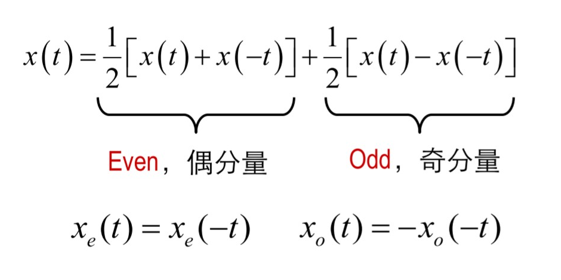

### Real and Imaginary Components

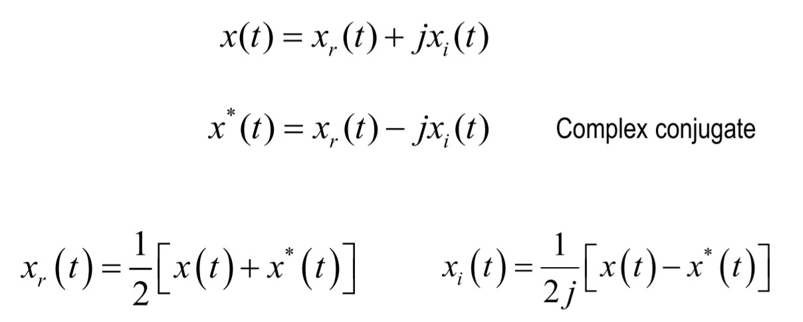

## 1.7 Systems

a process in which **input signals** are transformed by the system or cause the system to respond in some way, resulting in other signals as **outputs**

### Descriptions

- input and output description
  N-order linear differential equation
- state-space description
  N first-order differential equations

### Interconnections

- series interconnection

  
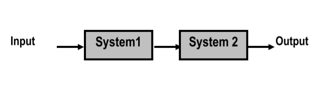

- parallel interconnection

  
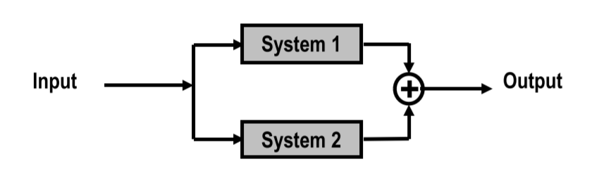

- feedback connection

  
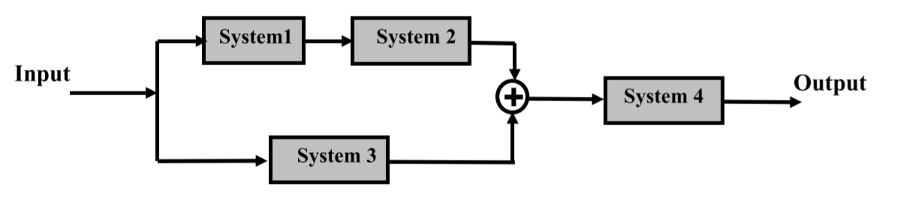

- complicated connection which combine the former two interconnections

  
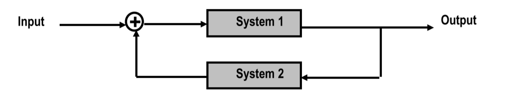

## 1.8 Basic System Properties

### Linearity

- additivity

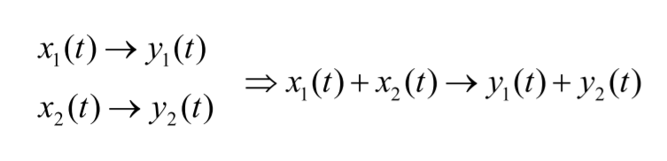

- homogeneity

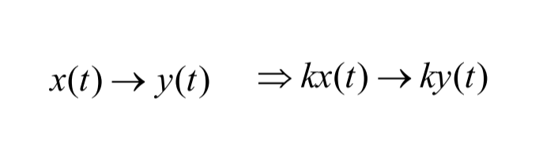

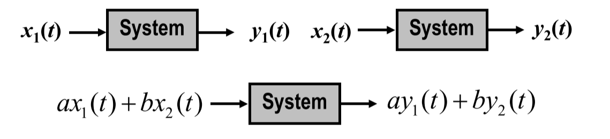

### Time-Invariant

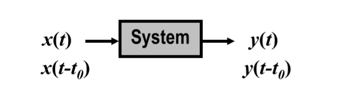

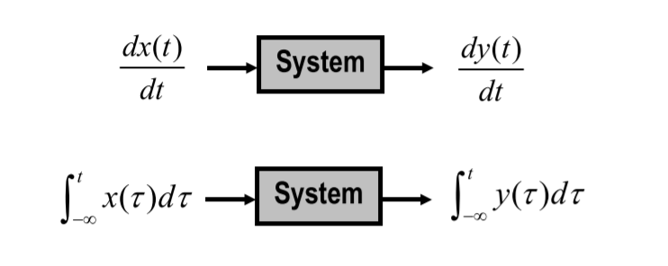

### With Memory

- memoryless

  its output for each value of the independent variable at a given time is dependent **only on the input at that same time**

- system with memory

  it **retains or stores information** about input values at time other than the current time
  _E.g.: Accumulator, Delay;_

### Causality

- casual system

  output depends **only on the input at present time** and in the past

  _All memoryless systems are casual systems_

- non-casual system
  _E.g.: Data Smoothing_

### Invertibility

distinct input lead to distinct output

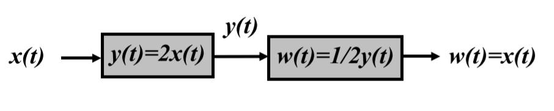

### Stability

if the input to a stable system is bounded, then the output must also be bounded

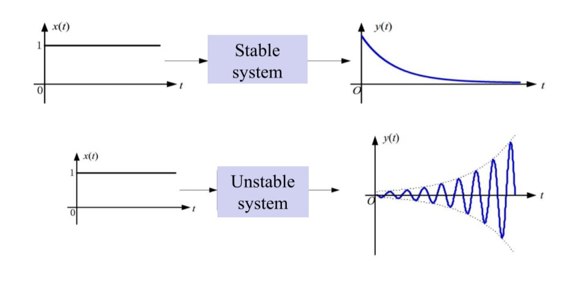

