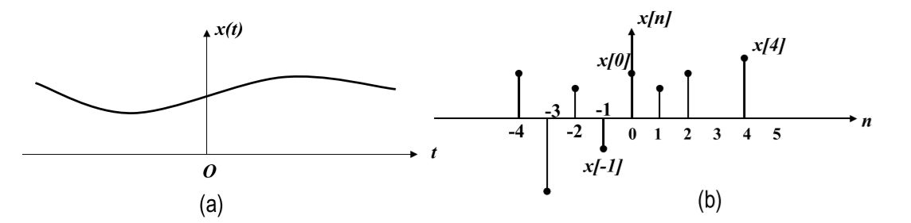
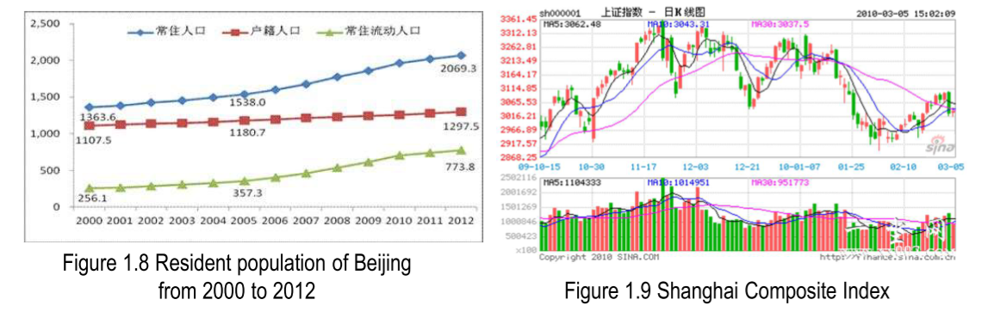
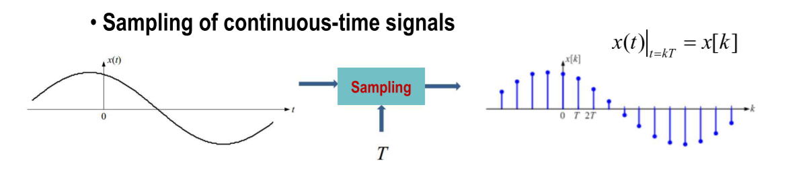
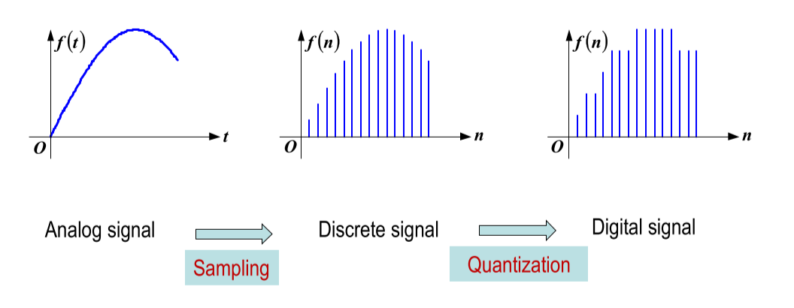

# CH_1

## signals

### communication system

a function conveys information about the behavior or attributes of some phenomenon

### physical world

quantity exhibiting variation in time or variation in space

**signals are mathematical functions**

- Independent variable = time

- Dependent variable = voltage, flow rate, sound pressure, ...

**signals can be represented by graph**

## classifications of signals

### continuous-time and discrete-time signals

- continuous-time signals' independent variable is continuous

- discrete-time signals are defined only at discrete times:

- the independent variable is inherently discrete

- sampling of continuous-time signals

### analog and digital signals

- analog signals: continuous in both time and amplitude
- digital signals: discrete in both time and amplitude

### periodic and aperiodic signals

- for continuous-time

  

- for discrete-time
  

### determinate and random signals

- **a determinate signal**: _x(t)_

- a random signal: cannot find a function to represent it

        E.g.: noise, speech

### energy and power signals

- energy signals 

- power signals 

- signals with neither finite E nor finite P 

## Transformations of the Independent Variable of Signals

- time shift

- time reversal _(left +, right -)_

- time scaling

**First Scaling, Second Shift**

**先尺缩，再平移**

## Some Useful Signal Modes

1. Real Exponential Signals

2. Periodic Complex Exponential and Sinusoidal Signals

3. General Complex Exponential Signals

- When r=0, both parts are sinusoidal; 
- When r>0, both parts are growing sinusoidal;
- When r<0, both parts are decaying sinusoidal (damped sinusoids).

4. Sampling Signals

## The Unit Impulse and Unit Step Functions

- Unit Step Function

- Unit Impulse Function

1. **Sampling Property**

2. Even Function

3. Time Scaling

4. **Relationship to Unit Step Function**

- Impulse Doublet Signal 

1. **Sampling Property**

2. Scaling

3. Odd Function

## Signal Decompositions and Components of a Signal

### Even and Odd Components

### Real and Imaginary Components

