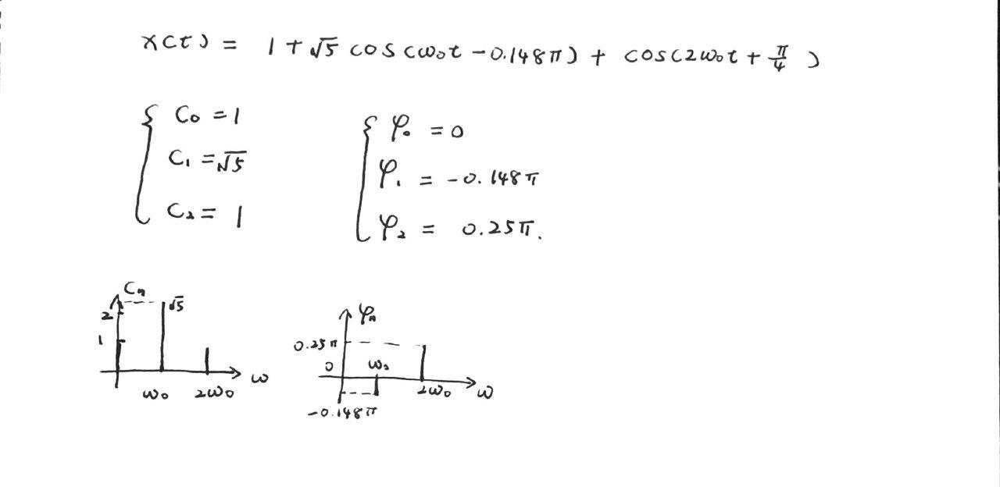
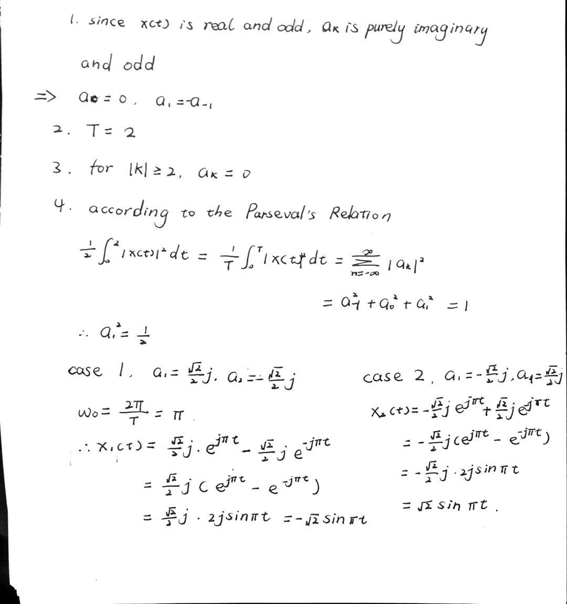
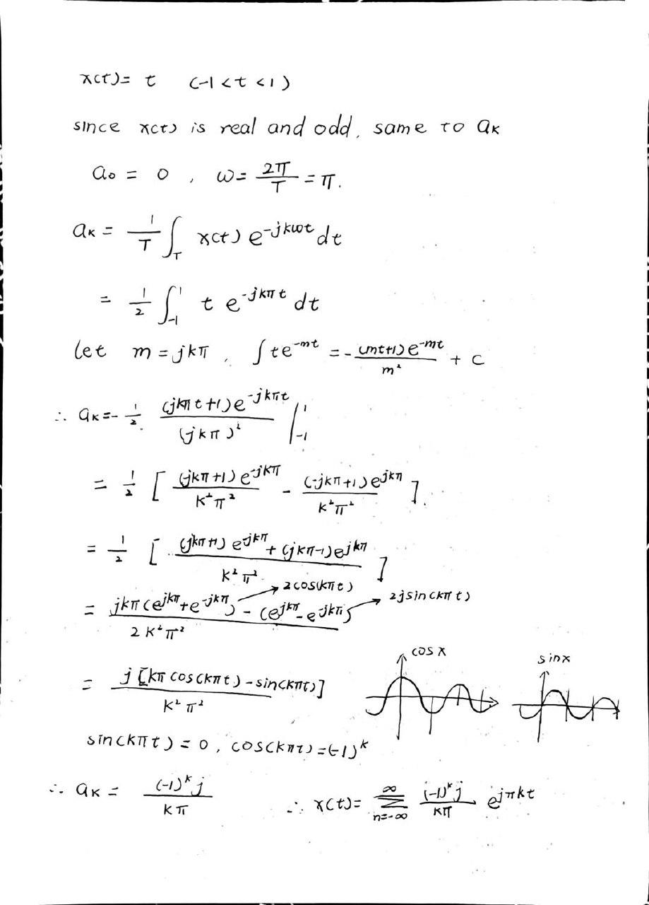
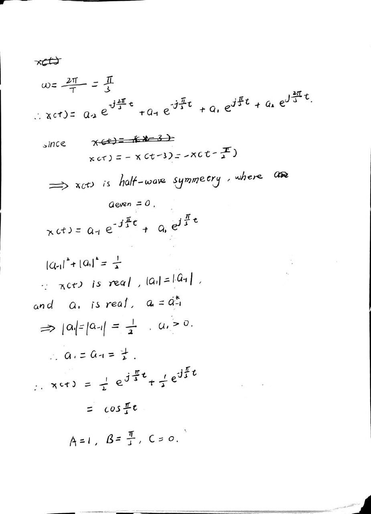

# EX_4

[TOC]

## EX 4.1

Consider a real periodic signal x(t), with fundamental frequency $2\pi$, that is expressed in the complex exponential Fourier series as

$$
x(t) =\sum_{k=-3}^{3}{a_k e^{jk2\pi t}}
$$

where $a_0 = 1$, $a_1=a_{-1} = 1/4$, $a_2=a_{-2}=1/2$, $a_3=a_{-3}=1/3$

## EX 4.2

Consider the signal

$$
x(t) = 1+\sin{\omega_0 t}+2\cos{\omega_0 t}+\cos{(2\omega_0t+\frac{\pi}{4})}
$$

Plot the magnitude spectrum and phase spectrum of $x(t)$

## EX 4.3

The periodic square wave is defined over one period as:

$$
x(t) =
\begin{cases}
    1\qquad |t|<T_1\\[2ex]
    0\qquad T_1<|t|<T/2\\[2ex]
\end{cases}
$$

Represent it in Fourier series

## HW 3.1

Suppose we are given the following information about a signal x(t):

1. x(t) is real and odd
2. x(t) is periodic with period T = 2 and has Fourier coefficients $a_k$
3. $a_k = 0$ for $|k|>1$
4. $\frac{1}{2}\int_0^2{|x(t)|^2\mathrm{d}t}=1$

Specify two different signals that satisfy these conditions

## HW 3.2

Determine the Fourier series representations for the following signals

> fix: $a_k$ is purely imaginary and odd

## HW 3.3

Suppose we are given the following information about a signal x(t):

1. x(t) is a real signal
2. x(t) is periodic with period T = 6 and has Fourier coefficients $a_k$
3. $a_k = 0$ for $k = 0$ and $k > 2$
4. $x(t)=-x(t-3)$
5. $\frac{1}{6}\int_{-3}^3{|x(t)|^2\mathrm{d}t}=\frac{1}{2}$
6. $a_1$ is a positive real number

Show that $x(t)=A\cos(Bt+C)$, and determine the values of the constants A, B and C

