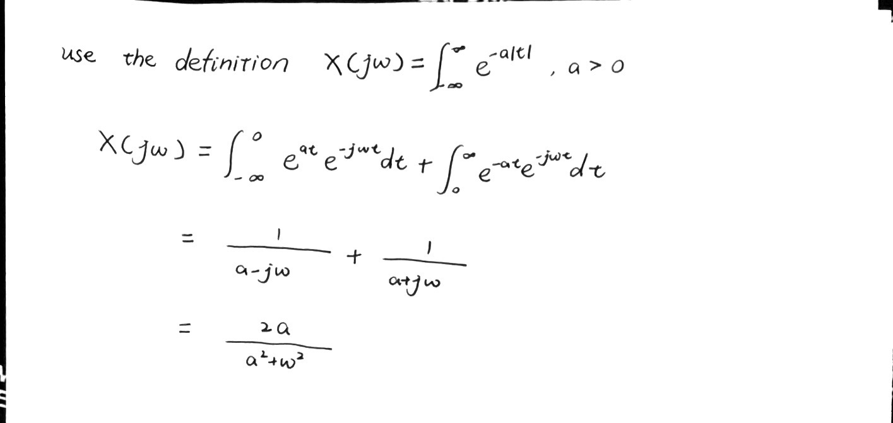
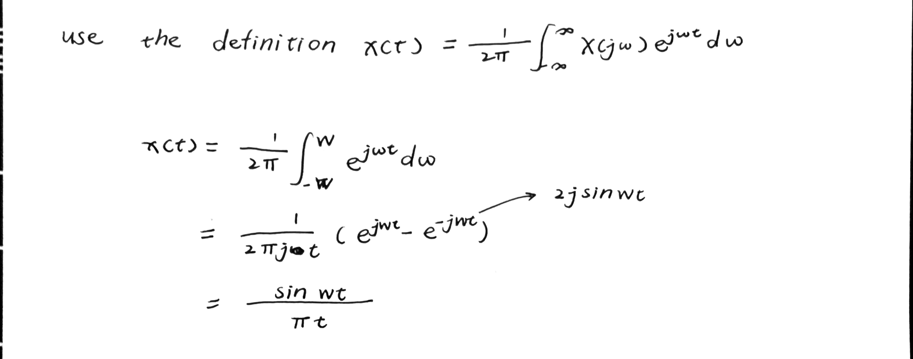
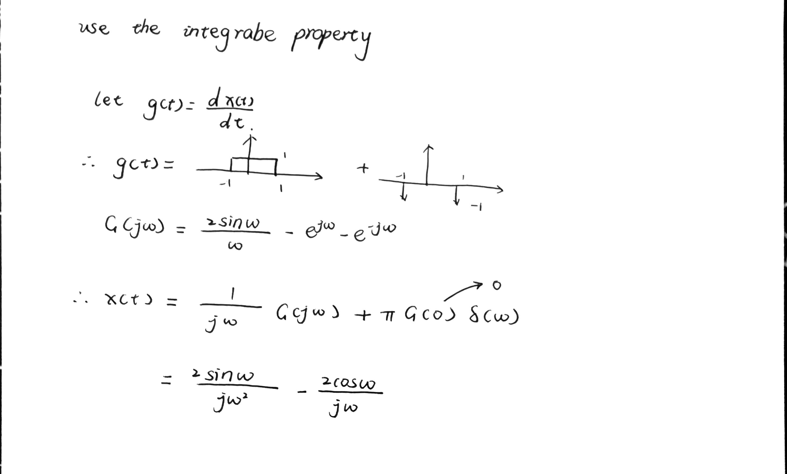
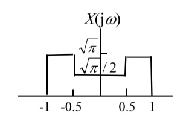

# EX 5

[TOC]

## EX 5.1

Find the Fourier transform of the signal $x(t)=e^{-at}u(t)$, $a>0$

## EX 5.2

Find the Fourier transform of the signal $x(t)=e^{-\alpha|t|}$, $\alpha>0$

## EX 5.3

Find the original form of the signal $x(t)$ whose Fourier transform is

$$
X(j\omega) = 
\begin{cases}
    1 \qquad |\omega|<W\\[2ex]
    0 \qquad |\omega|>W\\[2ex]
\end{cases}
$$

## EX 5.4

Determine the Fourier transform of $x(t)$ showed in the following figure

## EX 5.5

Determine the Fourier transform of the unit step $x(t)=u(t)$

## EX 5.6

Determine the Fourier transform of the signal $x(t)$ displayed in the following figure

## EX 5.7

Given the Fourier transform , evaluate the following time-domain expressions

$$
E = \int_{-\infty}^{\infty}{|x(t)|^2\mathrm{d}t}\\[2ex]
D = \frac{\mathrm{d}}{\mathrm{d}t}x(t)|_{t=0}
$$

